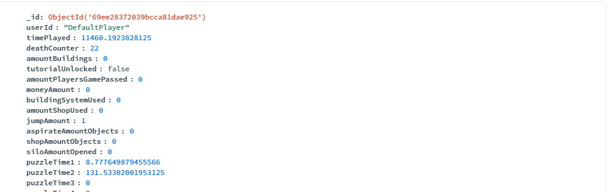
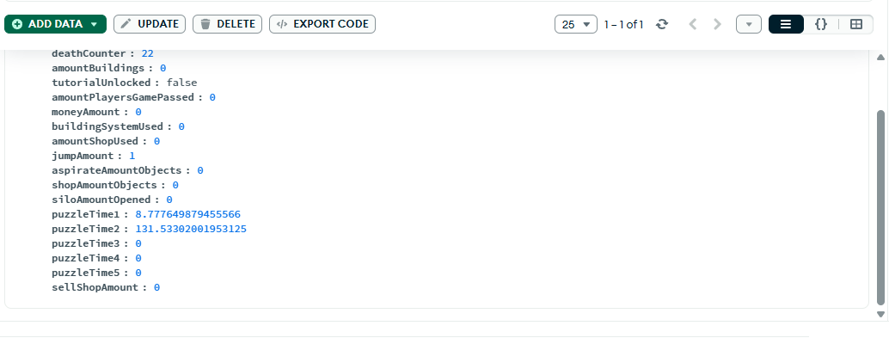

# 📊 Data Persistence & MongoDB Integration

This document explains how GlowRancher manages player statistics, synchronizes data with the cloud (MongoDB), and provides local fallbacks using Unity's `PlayerPrefs`.

---

## Architecture Overview

The data persistence system follows a hybrid approach:
1.  **Local Persistence (`PlayerPrefs`)**: Provides immediate, offline-ready storage for all player stats.
2.  **Cloud Persistence (MongoDB)**: Provides cross-device synchronization and long-term storage via a remote database.
3.  **Hub (`GameManager`)**: Orchestrates the flow between gameplay events, local storage, and the cloud.

---

## PlayerData Class

The `PlayerData` class is the core data structure used for all statistics. It is marked as `[System.Serializable]` for Unity and utilizes `[BsonIgnoreExtraElements]` for MongoDB compatibility.

**Location:** `Assets/Code/Scripts/Data/MongoDBReader.cs`

### Key Fields:
- `userId`: Unique identifier for the player (default: "DefaultPlayer").
- `timePlayed`: Total cumulative gameplay time in seconds.
- `moneyAmount`: Current currency balance.
- `deathCounter`: Number of times the player has died.
- `jumpAmount`: Total number of jumps performed.
- `puzzleTime1-5`: **Best completion times** (in seconds) for each of the 5 monolith puzzles.
- `buildingSystemUsed`: Count of buildings placed.
- `tutorialUnlocked`: Boolean flag for tutorial completion. <br>
ETC... All the stats that are being saved are in the first activity

---

## MongoDB Connection

The connection is handled by the `MongoDBReader` class using the official MongoDB C# Driver.

**Location:** `Assets/Code/Scripts/Data/MongoDBReader.cs`

### Connection Setup:
The `Awake()` method initializes the `MongoClient` using a connection string and targets the `GlowRancher` database and `UserStats` collection.

```csharp
var client = new MongoClient("mongodb+srv://...");
var database = client.GetDatabase("GlowRancher");
_collection = database.GetCollection<PlayerData>("UserStats");
```

### Data Flow:
1.  **Loading (`LoadStats`)**: Performed on game start. It queries the collection for a document matching the `userId`.
2.  **Saving (`SaveStats`)**: Uses an **Upsert** operation (`ReplaceOneAsync` with `IsUpsert = true`). This means if the document exists, it is updated; if not, a new one is created.

---

## 🎮 GameManager Implementation

The `GameManager` acts as the "brain" for data management.

**Location:** `Assets/Code/Scripts/Systems/GameManager.cs`

### Initialization Workflow:
1.  **`Awake()`**: Loads **all** fields from local `PlayerPrefs`. This ensures the game starts with the last known state even if the user is offline.
2.  **`Start()`**: Attempts to connect to MongoDB. If successful, it overwrites the local `data` with the cloud version and triggers `OnStatsLoaded`.

### Saving Logic:
The `SaveStats()` method is exhaustive:
1.  It writes every field in `PlayerData` to `PlayerPrefs`.
2.  It synchronizes the `money` from the `Player` instance.
3.  It triggers an asynchronous `SaveStats` call to the `MongoDBReader`.
4.  It logs a detailed summary to the Unity Console for verification.

### Best-Time Logic (Puzzles):
When a puzzle is completed via `SetTimePuzzle(float time, int monolitoNumber)`, the manager compares the new time with the existing one. It only saves the new time if it is **faster** (lower) than the previous record.

---

## Debugging & Verification

Whenever a save occurs, the following log appears in the Console:

```text
[GameManager] Stats saved successfully:
- Time: 123.45s
- Money: 500
- Deaths: 2
...
```

As you can see in the images, the connection is fine with MongoDB Atlas. Below are some screenshots of the results:





